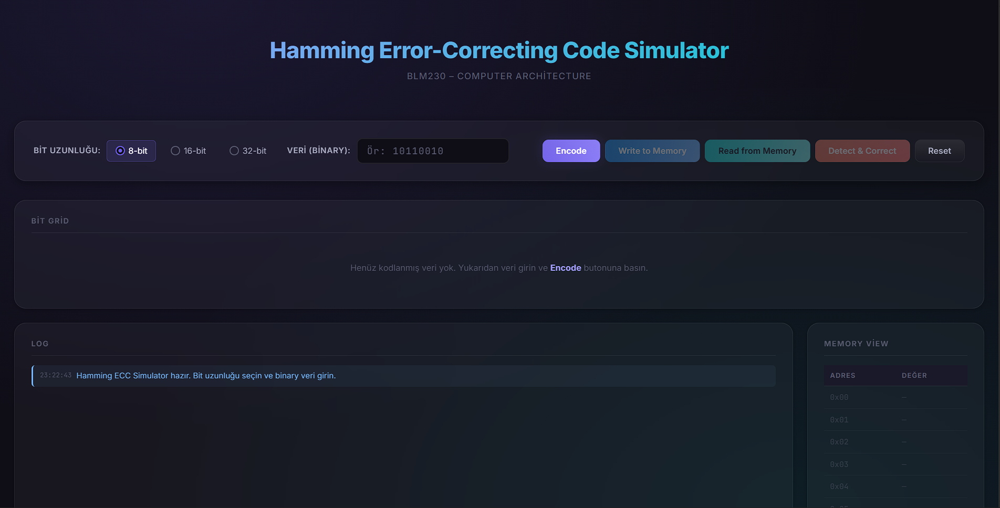

# 🛠️ Hamming Error-Correcting Code Simülatörü

Bu proje, **BLM230 Bilgisayar Mimarisi** dersi kapsamında Hamming kodlama algoritmasını interaktif olarak öğrenmek ve test etmek için geliştirilmiş bir web tabanlı simülatördür.

---

## 🚀 Özellikler

- ✅ **8-bit, 16-bit ve 32-bit giriş desteği**
- 🔐 **Otomatik Hamming Kodu Üretimi (Encoding)**
- 💾 **Sanal Bellek Simülasyonu (Belleğe Yazma / Okuma)**
- 🧪 **Yapay Hata Enjeksiyonu (Bellekten okunan veride istenilen biti değiştirme)**
- 🔍 **Sendrom Kelimesi (Syndrome Word) ile Hata Tespiti ve Düzeltme (Detect & Correct)**
- 🖥️ **Kullanıcı Dostu ve Modern Arayüz (Görsel Animasyonlar ve Log Paneli)**

---

## 📷 Ekran Görüntüsü



---

## 🎥 Demo Videosu

Projeyi çalışırken görmek istersen aşağıdaki bağlantıya tıklayarak demo videosunu izleyebilirsin:

📺 [YouTube'da İzle - LİNKİNİZİ BURAYA YAPIŞTIRIN](#)

---

## 🧪 Nasıl Çalıştırılır ve Kullanılır?

Projenin çalışması için herhangi bir harici sunucuya veya kuruluma ihtiyacınız yoktur.

1. **Çalıştırma:** Klasör içerisindeki `index.html` dosyasını çift tıklayarak herhangi bir web tarayıcısında (Google Chrome, Edge, vb.) açın.
2. **Veri Girişi:** Üst kısımdan 8, 16 veya 32 bitlik uzunluğu seçin ve binary (sadece 0 ve 1) verinizi girin.
3. **Kodlama:** `Encode` butonuna tıklayarak Hamming kodunu (Parity bitleri ile birlikte) oluşturun.
4. **Bellek İşlemleri:** `Write to Memory` butonu ile veriyi sanal belleğe yazın ve ardından `Read from Memory` butonu ile bellekten geri okuyun.
5. **Hata Enjeksiyonu:** Bellekten okuma yaptıktan sonra, ekrandaki bit gridi üzerinde **herhangi bir bit hücresine tıklayarak** o bitin değerini (0 ise 1, 1 ise 0) yapay olarak bozabilirsiniz.
6. **Hata Tespiti ve Düzeltme:** `Detect & Correct` butonuna basarak, hatanın "Sendrom Kelimesi" yardımıyla hangi pozisyonda olduğunu tespit edip düzelttiğini log panelinden ve ekrandan izleyin.

---

## 📁 Proje Yapısı

```text
Hamming_Code/
├── index.html       # Ana arayüz ve DOM yapısı
├── style.css        # Modern, karanlık tema ve animasyon stilleri
├── hamming.js       # Saf Hamming hesaplama (Encode, Decode, Sendrom vb.)
├── memory.js        # Sanal bellek ve bit bozma (flip) mantığı
└── ui.js            # Kullanıcı etkileşimi ve görsel bileşen yönetimi
```
